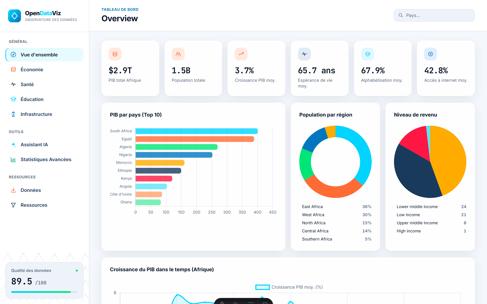
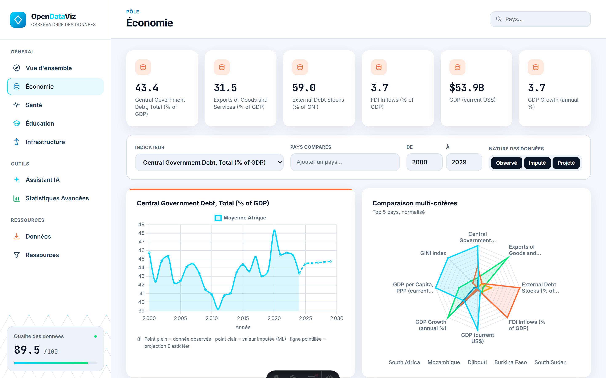
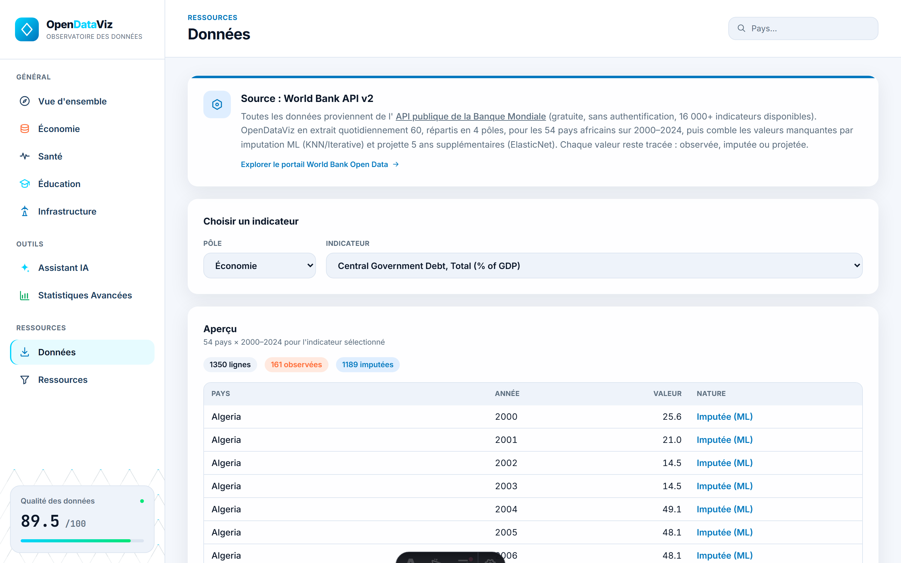
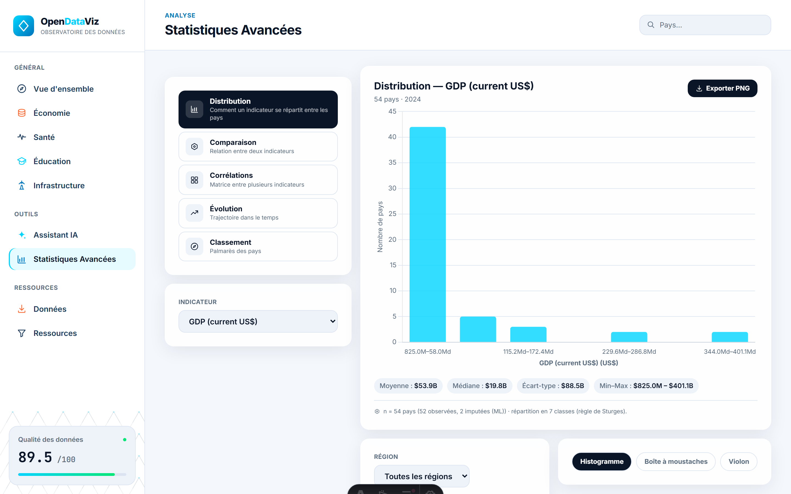
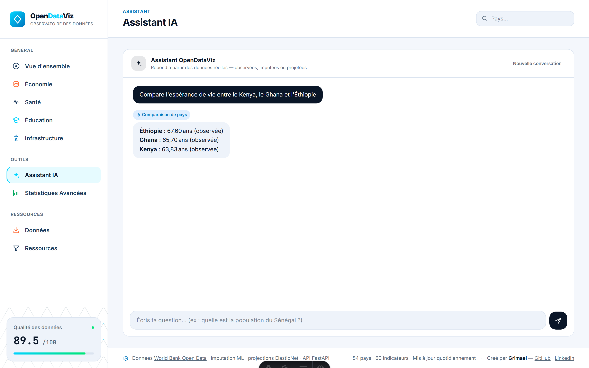

# OpenDataViz

**Un observatoire de données économiques pour l'Afrique subsaharienne.** Un pipeline ETL Python extrait 60 indicateurs répartis en quatre pôles (Économie, Santé, Éducation, Infrastructure) depuis l'API de la Banque mondiale pour les 54 pays africains, comble les lacunes historiques par imputation ML, projette cinq ans en avant, et restitue le tout via une API REST, un assistant IA conversationnel et un dashboard Astro doté d'un véritable atelier d'analyse statistique.

Par **Grimael** — [GitHub](https://github.com/grimael) · [LinkedIn](https://linkedin.com/in/grimael)

[](https://python.org)
[](LICENSE)

---

## Aperçu

| Vue d'ensemble | Page pôle (Économie) |
|---|---|
|  |  |

| Onglet Données | Statistiques Avancées |
|---|---|
|  |  |

**Assistant IA en action** — chaque réponse est ancrée dans une requête réelle, jamais inventée :



---

## Sommaire

- [Fonctionnalités](#fonctionnalités)
- [Architecture](#architecture)
- [Couverture des données](#couverture-des-données)
- [Démarrage rapide](#démarrage-rapide)
- [Le dashboard](#le-dashboard)
- [L'API](#lapi)
- [L'assistant conversationnel](#lassistant-conversationnel)
- [Sécurité](#sécurité)
- [Structure du projet](#structure-du-projet)
- [Modèle dimensionnel](#modèle-dimensionnel)
- [Accès aux données](#accès-aux-données)
- [Qualité des données](#qualité-des-données)
- [Tests](#tests)
- [Stack technique](#stack-technique)
- [Auteur](#auteur)

## Fonctionnalités

| Fonctionnalité | Description |
|---|---|
| Pipeline ETL | Extrait ~80K enregistrements depuis l'API World Bank v2, avec retry + backoff exponentiel |
| Modèle en étoile | Modèle dimensionnel dans DuckDB (table de faits + 3 dimensions + projections) |
| Imputation ML | Imputation multivariée KNN / itérative, entièrement flaguée et auditable |
| Projections | Prévisions à 5 ans (ElasticNet) par pays/indicateur, avec R² in-sample |
| Qualité des données | Score automatisé sur complétude, validité, fraîcheur + transparence sur l'imputation |
| API REST | Service FastAPI, doc Swagger, limitation de débit, export CSV / Excel / Stata / SPSS / Parquet |
| Dashboard | Astro + Chart.js, design en bento-grid, 4 pages pôle + une vue d'ensemble globale |
| Statistiques Avancées | Un véritable atelier statistique dans le navigateur : distributions, corrélations, comparaisons, tendances, classements sur 8 types de graphiques |
| Onglet Données | Catalogue central et filtrable des 60 indicateurs — le *seul* endroit où le téléchargement se fait |
| Assistant IA | Agent conversationnel (Groq/Gemini) ancré dans l'entrepôt de données via function calling — chaque chiffre qu'il donne est récupéré en direct, jamais rappelé de la mémoire du modèle |
| Rafraîchissement quotidien | Un cron GitHub Actions relance tout le pipeline chaque matin |

## Architecture

```
┌────────────────────────┐
│   World Bank API v2    │  Gratuite, sans auth, 16K+ indicateurs
└──────────┬─────────────┘
           │ Extraction (httpx + retry)
           ▼
┌────────────────────────┐
│  Transformation (Python)│  Nettoyage, enrichissement, calcul YoY
└──────────┬─────────────┘
           │ Chargement
           ▼
┌────────────────────────┐
│   Entrepôt DuckDB       │  Modèle en étoile : fact_indicators + 3 dims + projections
└──────────┬─────────────┘
           │
     ┌─────┴─────┐
     ▼           ▼
┌─────────┐  ┌───────────┐
│ Imputer │  │ Projeter  │  KNN / Itérative        ElasticNet, horizon 5 ans
│ (ML)    │  │ (ML)      │
└─────────┘  └───────────┘
           │
           ▼
┌────────────────────────┐      ┌──────────────────────────────┐
│  Qualité + Export       │─────▶│   FastAPI (api/)              │  REST + Swagger, CORS restreint,
└──────────┬─────────────┘      │   rate-limited, /agent/chat   │  connexion DuckDB read-only/requête
           │                    └──────────────┬────────────────┘
           ▼                                   │ tous les téléchargements + requêtes IA
┌────────────────────────┐      ┌──────────────▼────────────────┐
│  Dashboard Astro         │◄────▶│  Onglet Données + Assistant IA │
│  (dashboard/, statique)   │      │  (parcourir, exporter, poser des questions)│
└────────────────────────┘      └──────────────────────────────┘
```

En développement, le serveur Vite du dashboard fait proxy de `/api/*` (et `/openapi.json`) vers le processus FastAPI sur `localhost:8000` : le navigateur ne parle donc qu'à une seule origine (`localhost:4321`) — voir `dashboard/astro.config.mjs`.

## Couverture des données

**60 indicateurs** répartis en 4 pôles (15 chacun) · **54 pays** · **2000–2024 observé/imputé, 2025–2029 projeté**

| Pôle | Exemples |
|---|---|
| Économie | PIB, PIB/habitant PPA, inflation, GINI, dette extérieure, taux de change, dette publique |
| Santé | Espérance de vie, dépenses de santé, mortalité infantile/maternelle, prévalence VIH, immunisation |
| Éducation | Taux de scolarisation (primaire/secondaire/tertiaire), alphabétisation, dépenses d'éducation, ratio élèves/enseignant |
| Infrastructure | Accès à l'électricité, utilisateurs internet, eau/assainissement, mobile/haut débit, routes pavées |

Catalogue complet : `pipeline/config.py` (`INDICATORS`), ou `GET /indicators` sur l'API.

## Démarrage rapide

### Prérequis
- Python 3.12+
- Node.js 22+ (pour le dashboard)

### 1. Pipeline

```bash
pip install -r requirements.txt

# Tout exécuter : extraction → transformation → chargement → imputation → projection → qualité → export
python -m pipeline.main all

# Ou étape par étape
python -m pipeline.main pipeline   # ETL seul
python -m pipeline.main impute     # Imputation ML seule
python -m pipeline.main project    # Projections 5 ans seules
python -m pipeline.main quality    # Vérifications qualité seules
python -m pipeline.main export     # Export JSON pour le dashboard seul
```

Cela remplit `data/warehouse.duckdb` et les fichiers JSON que le dashboard lit depuis `dashboard/public/data/`.

### 2. API

```bash
uvicorn api.main:app --reload
# Swagger UI sur http://localhost:8000/docs
```

Ou via Docker (utile si l'installation native des dépendances compilées de FastAPI est bloquée par une politique de contrôle applicatif au niveau OS) :

```bash
docker build -f api/Dockerfile -t opendataviz-api .
docker run -d -p 8000:8000 -v "$(pwd)/data:/app/data" -v "$(pwd)/dashboard/public/data:/app/dashboard/data" opendataviz-api
```

### 3. Dashboard

```bash
cd dashboard
npm install
npm run dev      # http://localhost:4321
npm run build    # sortie statique dans dashboard/dist/
```

Lance l'API et le dashboard ensemble — pas besoin d'ouvrir deux ports manuellement ni de gérer le CORS en dev, le proxy s'en occupe.

### 4. Assistant conversationnel (optionnel)

L'onglet Assistant IA (`/assistant/`) a besoin d'une clé LLM. Copie `.env.example` vers `.env` à la racine du dépôt et renseigne l'une de ces clés :

```bash
GROQ_API_KEY=...    # https://console.groq.com/keys
GEMINI_API_KEY=...  # https://aistudio.google.com/apikey
```

Les deux passent par leurs endpoints compatibles OpenAI (`api/llm.py`), donc changer de fournisseur revient juste à modifier `LLM_PROVIDER=groq|gemini` dans `.env` — sans toucher au code. Modèles par défaut : `openai/gpt-oss-120b` (Groq), `gemini-3.6-flash` (Gemini) — surcharge possible avec `LLM_MODEL` si un fournisseur retire son modèle par défaut. Sans clé configurée, tout le reste du dashboard fonctionne normalement ; seul `/agent/chat` renvoie un 503 expliquant ce qui manque.

## Le dashboard

Astro 5 + Tailwind CSS v4, généré statiquement (aucun rendu côté serveur à l'exécution — chaque page est du HTML pré-généré qui s'hydrate avec un peu de TypeScript vanilla par page). Voir `dashboard/README.md` pour le détail page par page, les tokens de design et le workflow de dev.

Six pages : une vue d'ensemble (`/`), quatre pages pôle (`/economy/`, `/health/`, `/education/`, `/infrastructure/`), un catalogue de données centralisé (`/data/`), un atelier d'analyse statistique (`/statistiques/`), une page méthodologie (`/resources/`), et l'assistant IA (`/assistant/`).

## L'API

FastAPI, documentée en direct sur `/docs` (Swagger) et `/redoc`. Chaque route lit via une connexion DuckDB en lecture seule, ouverte par requête (`api/db.py`) — l'API ne détient jamais de verrou d'écriture qui pourrait entrer en collision avec le cron ETL nocturne.

| Route | Rôle |
|---|---|
| `GET /indicators` | Liste les 60 indicateurs, groupés par pôle |
| `GET /countries` | Liste les 54 pays avec métadonnées région/revenu |
| `GET /data/{indicator}` | Série complète observée + imputée pour un indicateur |
| `GET /projections/{indicator}` | Prévision 2025–2029 pour un indicateur |
| `GET /export/{indicator}` | Téléchargement d'un indicateur en CSV / Excel / Stata / SPSS / Parquet |
| `GET /health` | Connectivité de l'entrepôt + comptes de lignes + dernier score qualité |
| `POST /agent/chat` | Assistant conversationnel (voir ci-dessous) |

Tous les paramètres de requête qui sélectionnent un format, un scope ou un pôle sont validés par FastAPI lui-même via une regex/enum fixe (`Query(pattern=...)`), et chaque requête SQL de chaque route est paramétrée — aucune requête construite par concaténation n'inclut jamais directement une valeur fournie par le client.

## L'assistant conversationnel

`POST /agent/chat` ancre un LLM (Groq ou Gemini, function calling compatible OpenAI) dans l'entrepôt de données en direct : il dispose de 8 outils (`api/agent_tools.py`) qui reflètent un à un les routes REST — lister indicateurs/pays, récupérer une série temporelle, classer les pays, récupérer des projections, construire une fiche pays, comparer des pays, et vérifier la qualité des données — de sorte que chaque chiffre donné en réponse est récupéré en direct et étiqueté observé / imputé / projeté, jamais rappelé des données d'entraînement du modèle. Un plafond strict (`MAX_TOOL_ROUNDS = 4`) empêche toute boucle d'appels d'outils incontrôlée, et les échecs fournisseur (limite de débit, clé invalide, timeout) sont traduits en messages courts en français plutôt que de laisser fuir le corps brut de l'erreur du fournisseur.

## Sécurité

Ce projet a fait l'objet d'une revue de sécurité dédiée ; voir **[SECURITY.md](SECURITY.md)** pour l'audit complet — ce qui a été vérifié, ce qui a été trouvé, et comment chaque point a été corrigé (restriction CORS, limitation de débit par endpoint, limites de taille de requête, absence de fuite d'exceptions brutes, en-têtes de sécurité, garanties de paramétrage SQL). En bref : pour signaler un problème suspecté, ouvre une issue GitHub avec une reproduction claire — il n'y a pas de programme de bug bounty.

## Structure du projet

```
opendataviz-pipeline/
├── pipeline/                  # Package Python ETL + ML
│   ├── config.py               # Indicateurs (60, 4 pôles), pays, seuils qualité
│   ├── extract.py              # Extraction API World Bank avec retry
│   ├── transform.py            # Transformation des données & calcul YoY
│   ├── load.py                 # Chargement du modèle en étoile DuckDB
│   ├── imputation.py           # Comblement ML des lacunes (KNN/Itérative), par pôle
│   ├── projection.py           # Prévisions 5 ans (ElasticNet)
│   ├── quality.py              # Framework qualité (complétude/validité/fraîcheur/imputation)
│   ├── export.py               # Export JSON pour le dashboard
│   └── main.py                 # Point d'entrée CLI
│
├── api/                       # Service REST FastAPI
│   ├── main.py                  # Setup app : CORS, rate limiter, en-têtes sécurité, enregistrement des routes
│   ├── db.py                    # Connexion DuckDB read-only par requête
│   ├── limiter.py                # Instance slowapi Limiter partagée
│   ├── llm.py                    # Abstraction client Groq/Gemini pour l'assistant
│   ├── agent_tools.py            # 8 outils function-calling + dispatcher
│   ├── models.py                  # Modèles de réponse Pydantic
│   ├── utils.py                    # Résolution du code indicateur
│   ├── routes/                      # /indicators /countries /data /projections /export /health /agent
│   └── Dockerfile
│
├── dashboard/                  # Dashboard Astro statique — voir dashboard/README.md
│   ├── src/pages/                # index, [pole], data, statistiques, resources, assistant
│   ├── src/components/            # Sidebar, Header, Footer, BentoCard, KpiTile, IconSprite
│   ├── src/lib/                    # récupération des données, thème des graphiques, moteur stats, logique par page
│   └── public/data/                 # JSON généré (cible d'export du pipeline, versionné)
│
├── .github/workflows/etl.yml   # Cron GitHub Actions ETL quotidien
├── tests/                       # pytest — pipeline, imputation, projection, API
├── SECURITY.md                  # Audit de sécurité + référence de durcissement
└── data/                        # Entrepôt DuckDB (gitignored)
```

## Modèle dimensionnel

```
dim_country ◄──── fact_indicators ────► dim_indicator
     │                  │                     │
     │                  │                     │
dim_region         dim_date              (4 pôles)
                        │
                   projections (prévision 5 ans, par pays/indicateur)
```

- **fact_indicators** : ~80K lignes (54 pays × 60 indicateurs × 25 ans), flags `is_imputed` + `imputation_method`, variation YoY
- **dim_country** : 54 pays africains avec métadonnées (niveau de revenu, coordonnées, capitale)
- **dim_indicator** : 60 indicateurs répartis en 4 pôles, avec catégories et unités
- **dim_date** : 25 années (2000–2024)
- **projections** : prévision 2025–2029 par pays/indicateur, méthode + R² in-sample

## Accès aux données

Chaque téléchargement — brut ou corrigé par ML, dans n'importe quel format — n'est disponible qu'à un seul endroit : l'onglet **Données** du dashboard (`/data/`). Il n'est pas dupliqué sur les pages pôle, qui y renvoient à la place. Depuis là :

- Choisis un **pôle** et un **indicateur** pour prévisualiser la série complète 54 pays × 25 ans (observé vs imputé clairement indiqué).
- Télécharge la **série brute World Bank** (`scope=observed`, avec les trous) ou la **série corrigée ML** (`scope=all`, trous comblés et flagués) en **CSV, Excel (.xlsx), Stata (.dta), SPSS (.sav) ou Parquet**.
- Les deux scopes et tous les formats sont servis par le même endpoint : `GET /export/{indicator_code}?format=csv|xlsx|dta|sav|parquet&scope=observed|all`.
- Besoin de R ? Lis le CSV avec `read.csv()`, ou les fichiers Stata/SPSS avec `haven::read_dta()` / `haven::read_sav()`.

L'onglet **Statistiques Avancées** (`/statistiques/`) va plus loin : choisis 2+ indicateurs/pays et obtiens des distributions (histogramme + règle de Sturges, boxplot avec bornes 1.5×IQR), des corrélations (r de Pearson, régression OLS, matrice de corrélation en heatmap avec suppression par paires), des comparaisons, tendances et classements, tous exportables en PNG.

L'onglet **Ressources** (`/resources/`) documente le pipeline, les sources et la méthodologie qualité en langage clair pour les lecteurs non techniques.

## Qualité des données

Framework qualité automatisé qui note quatre dimensions — la complétude est mesurée uniquement sur les données **réellement observées** ; les valeurs imputées sont suivies séparément pour la transparence, jamais comptées dans la complétude :

| Dimension | Ce qui est vérifié |
|---|---|
| Complétude | % de valeurs non nulles, non imputées par indicateur |
| Validité | Valeurs dans les plages attendues |
| Fraîcheur | Ancienneté de la donnée la plus récente |
| Imputation | % de l'entrepôt comblé par ML, par méthode |

Scores en direct : `GET /health` sur l'API, ou le badge qualité présent dans la barre latérale de chaque page du dashboard.

## Tests

```bash
python -m pytest              # pipeline, imputation, projection, API
```

`tests/test_api.py` démarre l'app FastAPI contre un fichier DuckDB temporaire pré-rempli via `TestClient`, en surchargeant la dépendance `get_connection` — aucun appel réseau, aucun entrepôt réel nécessaire. `tests/test_imputation.py` requiert les extensions compilées de scikit-learn ; sur une machine où une politique de contrôle applicatif bloque les DLL natives, ce fichier est celui qui a le plus de chances d'échouer pour des raisons sans rapport avec le code.

## Stack technique

- **Python 3.12** — pipeline ETL
- **httpx** — client HTTP avec support retry
- **DuckDB** — base analytique in-process
- **scikit-learn** — imputation KNN/Itérative, projections ElasticNet
- **pandas** — manipulation de données pour les étapes ML
- **openpyxl / pyreadstat** — export Excel et Stata/SPSS
- **openai SDK** — client unifié pour Groq/Gemini (endpoints compatibles OpenAI), alimente l'Assistant IA
- **FastAPI** — API REST avec doc Swagger auto-générée
- **slowapi** — limitation de débit par endpoint
- **Astro 5** — génération de site statique pour le dashboard
- **Chart.js 4** (+ `@sgratzl/chartjs-chart-boxplot`) — graphiques interactifs (barres, lignes, nuage de points, donut, camembert, radar, boxplot, violin)
- **Leaflet.js** — carte choroplèthe de l'Afrique
- **Tailwind CSS v4** — système de design tokens CSS-first
- **GitHub Actions** — rafraîchissement automatique quotidien des données

## Auteur

Conçu et développé par **Grimael**.

- GitHub : [github.com/grimael](https://github.com/grimael)
- LinkedIn : [linkedin.com/in/grimael](https://linkedin.com/in/grimael)

## Licence

Licence MIT — voir [LICENSE](LICENSE) pour les détails.
